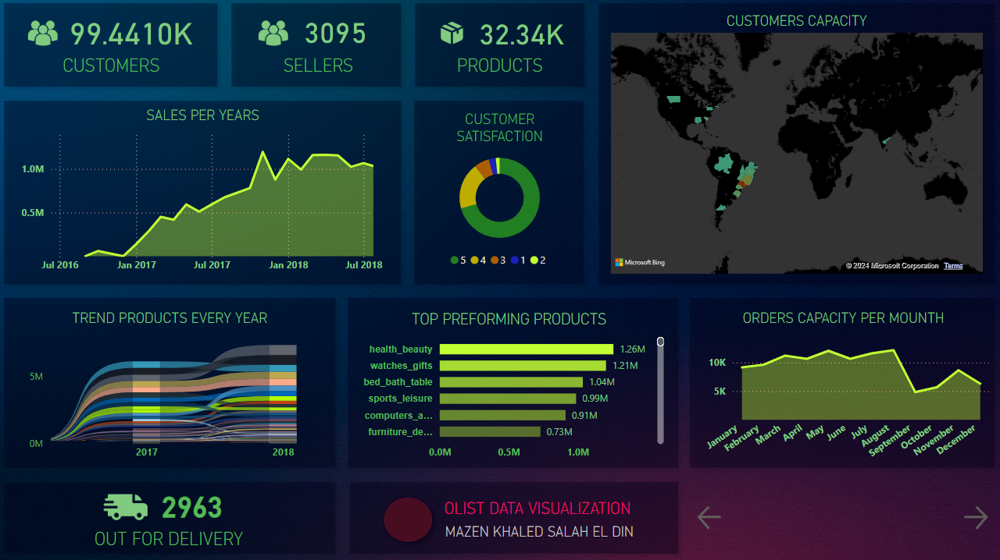
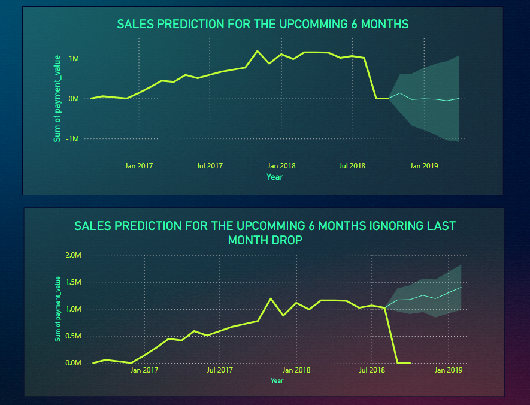

# Olist Data Analysis and Visualization Dashboard

This project provides a comprehensive data analysis and visualization dashboard for the Olist e-commerce dataset. The dashboard visualizes key metrics, trends, and predictions to facilitate better understanding and decision-making for business operations.

---

## Screenshots
### 1. Dashboard Metrics Overview

### 2. Geographic Mapping

### 3. Sales Predictions

---

## Features

### 1. **Dashboard Overview**
- **Customer Metrics**: Number of customers and sellers.
- **Product Information**: Total available products.
- **Sales and Satisfaction Analysis**: Yearly sales data and customer satisfaction distribution.
- **Customer Capacity Map**: Geographic distribution of customers.

### 2. **Trend and Product Insights**
- **Yearly Product Trends**: Analyze product popularity over time.
- **Top Performing Products**: Identify the most popular product categories.

### 3. **Order and Delivery Metrics**
- **Monthly Orders Capacity**: Orders handled each month.
- **Delivery Insights**: Number of items currently out for delivery.

### 4. **Geographic Mapping**
- **Nearest Sellers Map**: Visualize the nearest sellers to a specific customer with an adjustable maximum distance.

### 5. **Sales Prediction**
- **Future Trends**: Predict sales for the next six months.
- **Handling Anomalies**: Predict future trends by ignoring recent drops in sales.

---

## Data Source
The project utilizes the [Olist dataset](https://www.kaggle.com/olistbr/brazilian-ecommerce) available on Kaggle, which contains data about orders, sellers, products, and reviews.

---

## Usage
1. Start the application and open the dashboard in your browser.
2. Explore the various charts, maps, and metrics.
3. Adjust filters and sliders (e.g., for nearest sellers mapping) to customize the visualization.

---

## Author
Mazen Khaled Salah El Din
